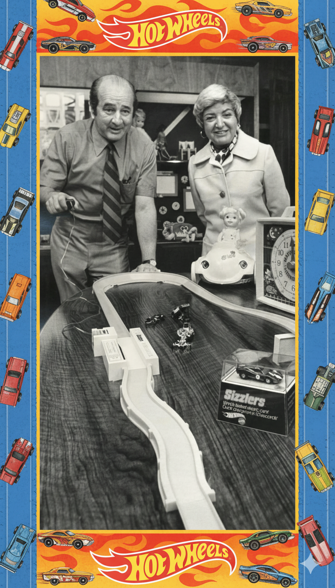

# Projeto EBOOK Gerado por I.A.s

 > ℹ️ **NOTE:** Este é o repositório desenvolvido durante o curso no qual fui instrutor técnico na plataforma da [DIO](https://dio.me)

Projeto com o objetivo de gerar um ebook digital com as facilidades das ferramentas de IA. todos os prompts
seguem abaixo.

<a href="https://github.com/felipeAguiarCode/prompts-recipe-to-create-a-ebook/blob/main/output/ebook%20-%20css%20jedi%20output.pdf" title="View PDF now"> 📕Clique aqui para ler</a>

## 💻 Tecnologias utilizadas no projeto

- [ChatGPT](https://chat.openai.com/) 
- [Google AI Studio](https://aistudio.google.com/)
- [PowerPoint](https://www.microsoft.com/en/microsoft-365/powerpoint)

## 🧠 Prompts

ChatGPT：

|   Ação   | prompt                                                                                                                                                                                                                                                                         |
| :------: | ------------------------------------------------------------------------------------------------------------------------------------------------------------------------------------------------------------------------------------------------------------------------------ |                                             |
| conteúdo | Estou criando um ebook virtual sobre a história da hot wheels. Me fale separando por capítulos sobre: Elliot e Ruth, história do casal. Elliot fracassando em suas invenções, enquato ruth criou a Barbie e manteve a empresa por anos. Elliot continuou buscando sempre novas invenções para alcançar o sucesso da esposa o que era inadmissível na época. Então viu seu neto brincando com Matchbox sobre mesa do escritório e se questionou se aquilo era realmente os mais rápidos do mercado e porque dominavam| então daí surgiu a ideia de criar os hot wheels, rodas quentes, brinquedos velozes que trariam uma imersão muito maior para as crianças e revolucionaria o mercado.| Contratou um ex design da GM para criar os primeiros hot wheels, sweet 16, com protótipo branco camaro custom, Fale sobre successo da marca e que o protótipo da beach bomb rosa hoje em dia é considerado o hot wheels mais valioso da história |

Midjourney：

|  Ação  | prompt                                                                                 |
| :----: | -------------------------------------------------------------------------------------- |
| título | Crie uma borda com tema Hot Wheels para esta foto (Foto de Elliot com Ruth juntos) |

## ✨ Features

- Conteúdo gerado via ChatGPT
- Imagens geradas via Google AI Studio

## 📚 Materiais

- Imagens utilizadas em `assets`
- ebook gerado durante as aulas em `output`

## 🛠️ Instruções de execução

Utilize os prompts acima nas ferramentas sugeridas para gerar o material base e utilize uma ferramenta de edição de documentos como power point, libreoffice , indesign para diagramação.
